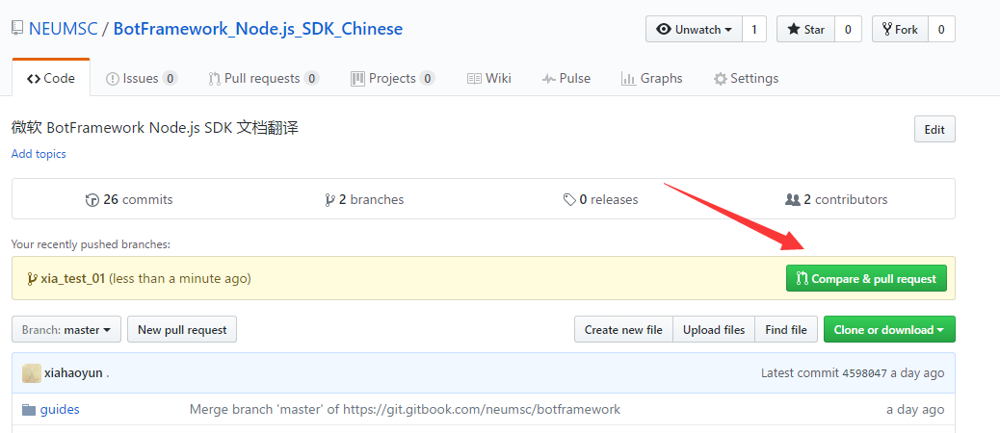

**每个人认领一部分，在README.md中，自己想认领的部分的标题后面写上自己的名字。**

## 约定：
1. 对于特别的名词不翻译。
2. 所有markdown文件名都设置为原来的英文名，单词之间用下划线隔开


# 工作流程：

## 首次使用：
将项目克隆到本地：找一个文件夹，打开shell
```
git clone  https://github.com/NEUMSC/BotFramework_Node.js_SDK_Chinese.git
```


## 之后
工作前


### 1. pull下来
 ```shell
# 获取主干最新代码
$ git checkout master
$ git pull
```


### 2. 自己建立一个分支
```shell
# 新建一个开发分支 xia_UniversalBot_01
$ git checkout -b xia_UniversalBot_01
```

分支名 username_title_01

第一个是你的用户名，知道是你就行

第二个是你翻译的部分的标题

第三个部分可有可无


### 3. 在自己的分支上进行翻译。中间可以同步上去。

完成了一部分之后进行一次commit,这里可以直接利用vscode或者atom集成的功能。来进行add 和commit操作。建议养成习惯，在commit的时候，写清楚commit的备注。


然后在Github 页面上，发出Pull Request


接下来就等待管理员将该分支合并。

