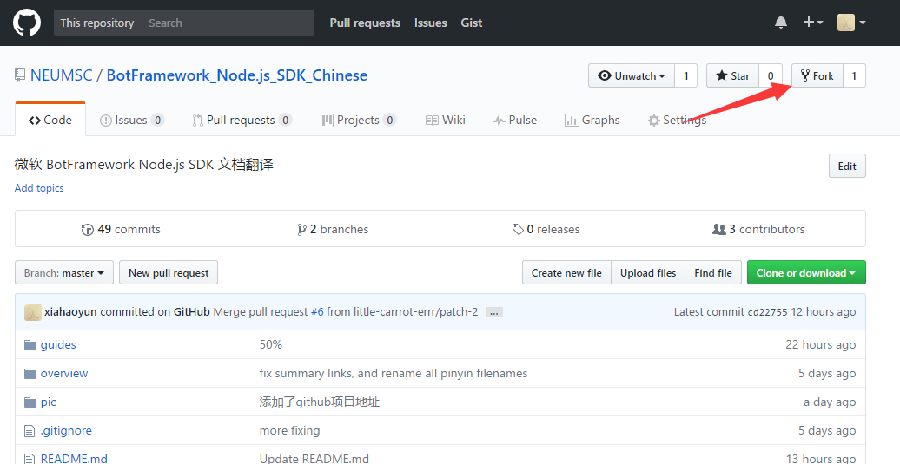
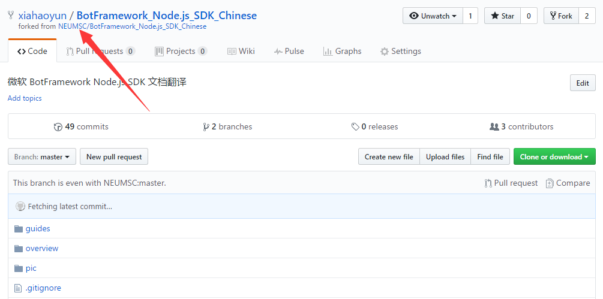
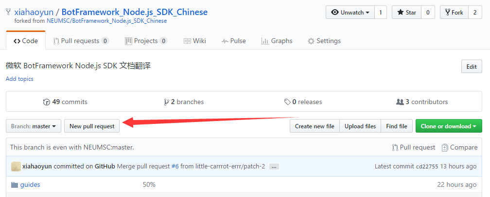

github的多人协作
================

先决条件：
1. github账号
2. git客户端

#### Fork

从NEUMSC的[翻译项目](https://github.com/NEUMSC/BotFramework_Node.js_SDK_Chinese)中fork一个到你自己的仓库




这时候我（xiahaoyun）想贡献代码了。fork之
fork之后，你的个人仓库就多了这个库

https://github.com/xiahaoyun/BotFramework_Node.js_SDK_Chinese




#### 开发并且提交代码

**clone**

首先要从github上下载代码到本地，你需要执行如下命令：

```
    git clone https://github.com/xiahaoyun/BotFramework_Node.js_SDK_Chinese.git 
    cd BotFramework_Node.js_SDK_Chinese
```

然后代码到本地里了，你就可以各种修改  add commit 了

**commit**

当你修改代码之后，需要commit到本地仓库，执行的命令如下：

xx是你更改的文件的文件名，也可以用一个`.`来代表所有更改的文件（夹）

    git add xx
    git commit  -m '修改原因，相关说明信息'


**push**

执行git commit之后，只是提交到了本机的仓库，而不是github上你账号的仓库。你需要执行push命令，把commit提交到服务器。

    这里你可以直接git push 木有问题直接到远程默认仓库，当然remote add 也木有问题，因为和操纵自己的库没有任何区别
    git push
    这里的git push  指的是push 到xiahaoyun/BotFramework_Node.js_SDK_Chinese 的默认仓库（master）

这里有**重点**

    这里你如果 git remote add origin https://github.com/NEUMSC/BotFramework_Node.js_SDK_Chinese.git
    好吧，你 
    git push origin master 之类的都是没用的
    因为你没有权限！没有权限修改别人(NEUMSC)的库!
    
    
    
    
#### 上游仓库
**添加远程仓库**

    git remote add origin https://github.com/NEUMSC/BotFramework_Node.js_SDK_Chinese.git

**更新远程代码：**
好吧，这里得分2种情况
1.拉取自己的库的最新的代码到本地（这个其实和操纵自己的库没撒区别）

    git pull 

2.你正在开发，主作者【项目负责人】也在开发，你当时fork的代码已经不是文档翻译的最新的代码了。
 这时候的你对你的翻译部分肯定没问题，但是pull request 就有可以会出错，因为你fork的repo和现在的NEUMSC的repo已经不一样了。
 这时候理论上管理员会close你的request，让你先pull 文档翻译 的最新部分。
 于是乎
 ```
    git remote add neumsc https://github.com/NEUMSC/BotFramework_Node.js_SDK_Chinese.git
    git fetch neumsc master
 ```
自己merge代码 不和谐的地方，这里肯定不能git pull,会提示conflict 即代码是需要自己merge的
```
    git merge neumsc/master
```    
    你修改代码后
    
    git add 
    git commit
然后测试一下是不是已经拉取完成最新的了。

    git pull neumsc master 

你就会发现原先的出错不见了，变成了**everything update   **
    
你就可以提交到自己的远程版本库了。
```
    git push origin master
```   
之后你再pull request，NEUMSC那边就木有出现 不能 auto merge的情况了，然后管理员就merge你的代码到他的主分支去了。
功德圆满 ：）


#### pull request

登陆github，在你自己的账号中的仓库中点击pull request，就会要求你输入pull request的原因和详细信息，你确认之后。osteach的owner就会收到并且审查，审查通过就会合并到主干上。


